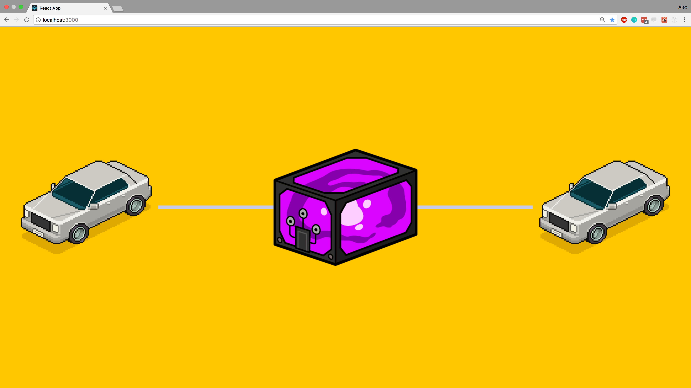

# Energy-trading
## Blockchain

> Blockchain is a linked list data structure where the links are hash pointers.

------

------

Centralised - Facebook, WhatsApp. Everything relies on one server.

Decentralized - Visa. Central structures,and small structures interconnected to the central structure.

Distributed - Bitcoin. Each node has the same power in the network.

------

## Description
Energy trading system for neighbor communities, build on Hyperledger Blockchain.

## Installation

After forking and cloning the repo:

The app divided in two parts:
* /server/
You need to follow the steps to initialize a Business Network on your computer.
* /client/
  `$npm install`
  `$npm start`

## Tech Stack

The app has been created using
- Hyperldger Composer : [composer](https://hyperledger.github.io/composer/)

- React : [facebook.github.io/react/](https://facebook.github.io/react/)

## Contributors

We love pull requests from everyone. By participating in this project, you agree to abide by the thoughtbot
[code of conduct]: https://thoughtbot.com/open-source-code-of-conduct

Fork, then clone the repo:
Push to your fork and  [submit a pull request].

## License

`Energy-trading` is licensed under the [MIT](http://www.opensource.org/licenses/mit-license.php)  license.
